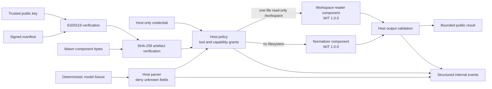

# Chapter 14 case study: a secure AI-agent tool runtime

Development-branch repository link:
<https://github.com/joshua-mo-143/production-webassembly-rust/tree/main/case-study>

This case study combines the book's stable WIT boundary, typed data exchange,
resource containment, capability-based WASI, fresh-store request isolation,
authenticated plug-in loading, host-owned agent policy, and multi-component
composition. The “model” is deliberately a set of deterministic JSON fixtures:
there are no network calls or external services.

## Architecture



The Rust host is the security boundary. It owns request parsing, schemas,
allowlists, credentials, capability grants, resource limits, artefact trust,
telemetry, and output validation. Components receive only typed WIT values and
their explicit WASI capabilities. Each call uses a fresh store with fuel and
memory limits. The normalizer gets an empty WASI context. For each reader
request, the host opens the authorized workspace file once, rejects more than
16 KiB, and stages those exact bytes as the only file in a request-specific,
read-only `/workspace` preopen. The guest receives no sibling-file authority.
The host also requires the returned path and contents to equal its authoritative
input, so a misbehaving component cannot substitute sibling contents.

The checked-in Ed25519 key pair is an
[RFC 8032 test vector](https://www.rfc-editor.org/rfc/rfc8032#section-7.1) and is
marked **TEST ONLY**. `provision` hashes the two built components, signs the
versioned signing bytes, and writes `target/ch14/manifest.json`. Signing bytes
are the ASCII domain
`production-webassembly-rust/ch14-manifest\0jcs-rfc8785\0v1\0` followed by the
RFC 8785 JSON Canonicalization Scheme (JCS) encoding of `signed`. Provisioning
and verification call the same `signing_bytes` function. Changing the domain,
canonicalization scheme, or payload semantics requires a new signing-byte
version. The test suite keeps the domain-separated golden Ed25519 signature
and independently specifies an RFC 8785 vector whose nested object keys must be
reordered and whose strings require JSON escaping. Plain `serde_json`
field-order serialization is asserted to differ from that vector.
Loading
first verifies the signature against the separately supplied public key, then
checks manifest policy, safe relative artefact paths, SHA-256 digests, and WIT
compatibility. Each component is read exactly once into host-owned memory; the
host hashes that byte buffer and passes the same buffer to Wasmtime for
compilation, so replacing the path between verification and compilation cannot
substitute unverified code. See the pinned
[Wasmtime v48.0.0 source](https://github.com/bytecodealliance/wasmtime/tree/v48.0.0/crates/wasmtime) and
[ed25519-dalek 2.2.0 API](https://docs.rs/ed25519-dalek/2.2.0/ed25519_dalek/).
The implementation references stable GitHub tags for
[Wasmtime v48.0.0](https://github.com/bytecodealliance/wasmtime/tree/v48.0.0)
and
[wit-bindgen v0.60.0](https://github.com/bytecodealliance/wit-bindgen/tree/v0.60.0).

## Threat model

| Threat | Control | Residual risk |
| --- | --- | --- |
| Model emits unexpected JSON, tools, or arguments | Size limit, `deny_unknown_fields`, per-tool schemas, allowlists | A real model remains untrusted and needs the same boundary |
| Tool asks for ambient filesystem or network access | Empty WASI context or a request-specific one-file read-only preopen; no socket grants | WASI/runtime vulnerabilities remain in the trusted computing base |
| Reader substitutes a sibling document | Host opens and bounds the authorized file, exposes only those staged bytes, and compares the typed result with its authoritative bytes | Path resolution still relies on the host OS and configured workspace |
| Component or manifest is replaced | Ed25519 signature, SHA-256 artefact digest, compile directly from the verified in-memory bytes, trusted public-key input, typed WIT instantiation | Test key has no production secrecy; key distribution and rollback protection are deployment concerns |
| Guest loops, allocates excessively, traps, or poisons state | Fuel, store limits, trap-on-growth failure, fresh stores | Fuel is deterministic work accounting, not a wall-clock deadline |
| Guest returns misleading or hostile output | Host validates identity, lengths, controls, and semantic counts; public output is truncated | Domain-specific validation must evolve with each tool |
| Errors leak paths, policy, or internals | Public `Display` is always `tool request failed`; structured categories stay internal | Operators must protect telemetry |
| Requests flood telemetry with attacker names | 64-event overwrite ring, overwrite counter, and closed tool identities (`Normalize`, `WorkspaceRead`, `Unknown`) | In-memory telemetry is process-local and lossy by design |
| Credential reaches untrusted code | Credential is host-owned and checked before dispatch; it is absent from WIT and store state | Host memory and process compromise are out of scope |

Trusted inputs are the host binary, configured public key, Wasmtime, operating
system, and the selected workspace directory. The model fixture, manifest file,
component files, tool arguments, and component outputs are untrusted.

## Build and run

Run these exact Fish commands from the repository root. They use only Cargo and
the repository files; do not install privileged packages.

```fish
cargo build --target wasm32-wasip2 \
 -p ch14-normalizer -p ch14-workspace-reader
cargo run -p ch14-host -- provision
cargo run -p ch14-host -- run
```

Expected output (Cargo build lines omitted):

```text
wrote authenticated test manifest: target/ch14/manifest.json
normalize: review then deploy
workspace-read: Deployments require review, a bounded rollout, and a health check.
classifications: fuel=FuelExhausted memory=MemoryLimitDenied invalid-output=InvalidOutput
structured-events: 2
network-calls: 0
```

Run the complete verification:

```fish
cargo fmt --all -- --check
cargo clippy --workspace --all-targets -- -D warnings
cargo clippy --target wasm32-wasip2 \
 -p ch08-guest -p ch14-normalizer -p ch14-workspace-reader -- \
 -D warnings
cargo build --target wasm32-wasip2 \
 -p ch08-guest -p ch14-normalizer -p ch14-workspace-reader
cargo run -p ch14-host -- provision
cargo test -p ch14-host -- --ignored
cargo test --workspace
```

Strict Clippy applies to all native and Wasm targets. Source-local allowances
remain scoped to guest component modules containing `wit-bindgen` expansions.

## Test matrix

| Case | Expected result |
| --- | --- |
| Normalization and read-only workspace read | Typed, validated success |
| Unknown tool | `UnknownTool`; generic public message |
| Known but ungranted tool | `DeniedTool` |
| Tool lacks its workspace grant | `DeniedCapability` |
| Malformed JSON, extra fields, traversal, wrong extension | Rejected before component execution |
| Signed manifest changed | Signature verification rejects load |
| Component bytes changed | Digest verification rejects load |
| Public key over 4 KiB, manifest over 64 KiB, or component over 16 MiB | Open-once `limit + 1` admission rejects it |
| Component path replaced after digest verification | Previously read, verified bytes still compile; invalid replacement is unused |
| Fuel loop, oversized allocation, and guest trap | Exact artifact-backed internal category |
| Component-declared failure | `ComponentDeclaredFailure` |
| Semantically invalid/control-character output | `InvalidOutput`, never inferred from a trap |
| Healthy request after classified failures | Succeeds in a fresh store |
| Unknown-tool telemetry flood | Ring stays at 64; overwrite count rises; attacker text is absent |
| Deliberately misbehaving reader opens `/workspace/sibling.txt` | WASI denies it; staged authorized read and normal runtime request then succeed |

`RuntimeFailure` remains a distinct internal category for engine, linker,
instantiation, and non-trap call failures. The Chapter 14 fixture does not
artificially induce an engine or linker failure, so the matrix does not claim
an artifact-backed `RuntimeFailure` assertion.

## Operational caveats

- Replace both test keys and the provisioning process. Keep the signing key
  offline; distribute the public key independently of manifests and artefacts.
- Add expiry, build identity, monotonic version/rollback protection, and an
  atomic release process before production deployment.
- Verification and compilation are race-free with respect to component
  contents, but production path resolution should additionally use an
  OS-specific immutable descriptor strategy such as Linux `openat2` with
  no-symlink constraints if avoiding every path-resolution race is required.
- Pin and audit the runtime and cryptographic dependency supply chain. The
  lockfile captures this example's resolved versions but is not a vulnerability
  management process.
- Add an epoch interruption or outer process deadline when wall-clock latency
  matters. Fuel alone does not bound blocking host operations.
- Workspace path authorization and opening are host responsibilities. The
  request-specific preopen limits guest disclosure to one staged file, but
  deployments requiring race-free path resolution should use an OS-specific
  descriptor strategy such as Linux `openat2`.
- Forward structured events to a protected sink with retention and redaction;
  this example keeps only the latest 64 in memory, counts overwritten events,
  and records no attacker-supplied names, arguments, or credential data.
